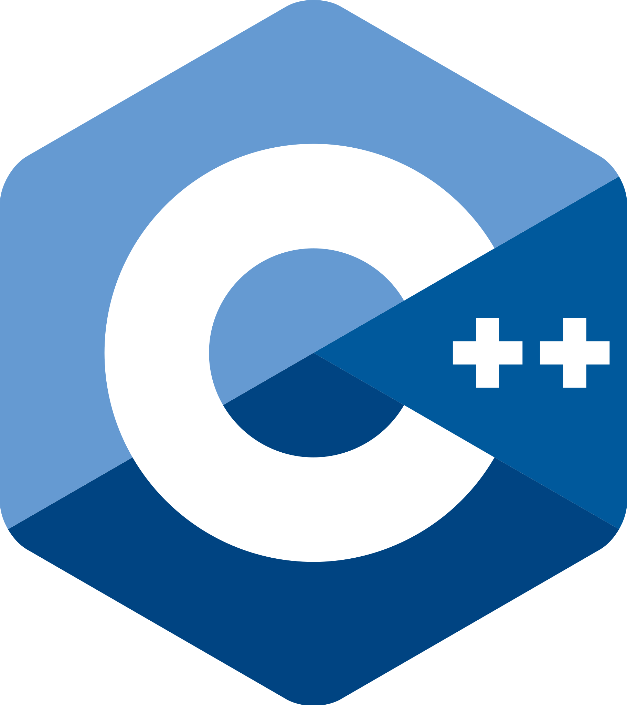
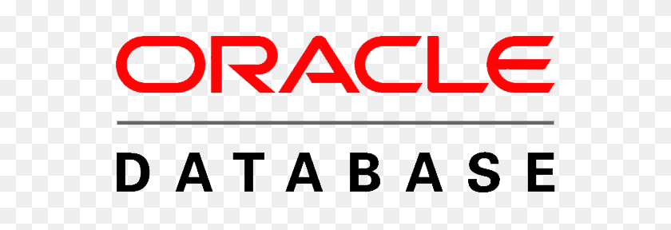

<h1 align="center">Hi, I'm Yannik 👋</h1>

  
  

  
<h1 align="center">About me</h1>
🏠 I live in the beautiful canton of Luzern, Switzerland 🇨🇭. 
👨‍💻 Currently working as a Java Software Engineer. 
🌱 I’m currently learning and improving my C++ and graphical programming skills. 
⚡ Interested in electronics and microcontrollers. 
☕️ Too much into Coffee.   

<h1>🛠 Technologies and tools</h1>
    <h2>Languages</h2>
    
    
    
    
    <h2>Libraries/Frameworks/APIs</h2>
    
    
    
    <h2>Database technologies</h2>
    
    
    

